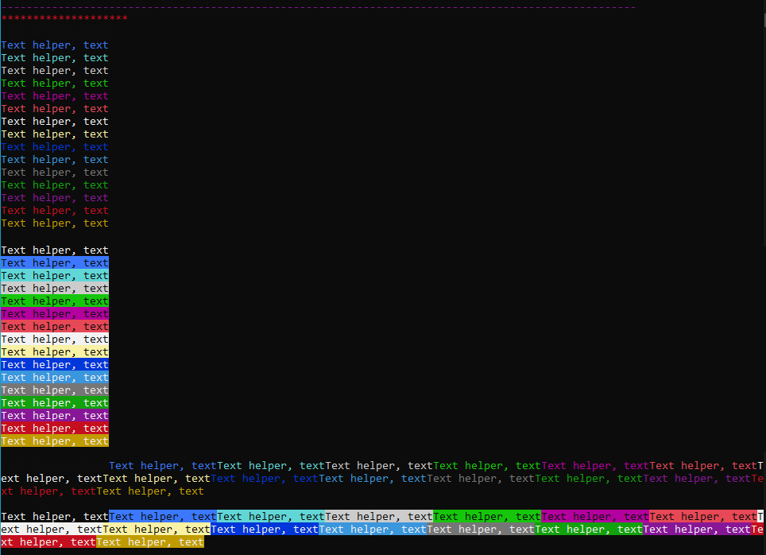

# ColoredConsoleShortcuts

*Helper Class* pour des projets .NET Console permettant d'afficher du texte ou des lignes en couleur, grâce à des fonctions servant de raccourcis.

Exemple d'utilisation :
```csharp

// Dash
ConsoleHelper.DashLineDarkMagenta();

ConsoleHelper.dashType = ConsoleHelper.DashType.Star; // changer le type de caractère
ConsoleHelper.dashLength = 20; // changer le nombre de caractères

ConsoleHelper.DashLineDarkRed();

// Color text line
ConsoleHelper.WriteLineBlack("Text helper, text");
ConsoleHelper.WriteLineBlue("Text helper, text");
ConsoleHelper.WriteLineCyan("Text helper, text");
ConsoleHelper.WriteLineGray("Text helper, text");
ConsoleHelper.WriteLineGreen("Text helper, text");
ConsoleHelper.WriteLineMagenta("Text helper, text");
ConsoleHelper.WriteLineRed("Text helper, text");
ConsoleHelper.WriteLineWhite("Text helper, text");
ConsoleHelper.WriteLineYellow("Text helper, text");
ConsoleHelper.WriteLineDarkBlue("Text helper, text");
ConsoleHelper.WriteLineDarkCyan("Text helper, text");
ConsoleHelper.WriteLineDarkGray("Text helper, text");
ConsoleHelper.WriteLineDarkGreen("Text helper, text");
ConsoleHelper.WriteLineDarkMagenta("Text helper, text");
ConsoleHelper.WriteLineDarkRed("Text helper, text");
ConsoleHelper.WriteLineDarkYellow("Text helper, text");
Console.WriteLine("\n");

// Backgroundcolor text line
ConsoleHelper.WriteBackgroundLineBlack("Test");
ConsoleHelper.WriteBackgroundLineBlue("Test");
ConsoleHelper.WriteBackgroundLineCyan("Test");
ConsoleHelper.WriteBackgroundLineGray("Test");
ConsoleHelper.WriteBackgroundLineGreen("Test");
ConsoleHelper.WriteBackgroundLineMagenta("Test");
ConsoleHelper.WriteBackgroundLineRed("Test");
ConsoleHelper.WriteBackgroundLineWhite("Test");
ConsoleHelper.WriteBackgroundLineYellow("Test");
ConsoleHelper.WriteBackgroundLineDarkBlue("Test");
ConsoleHelper.WriteBackgroundLineDarkCyan("Test");
ConsoleHelper.WriteBackgroundLineDarkGray("Test");
ConsoleHelper.WriteBackgroundLineDarkGreen("Test");
ConsoleHelper.WriteBackgroundLineDarkMagenta("Test");
ConsoleHelper.WriteBackgroundLineDarkRed("Test");
ConsoleHelper.WriteBackgroundLineDarkYellow("Test");
Console.WriteLine("\n");

// Color text
ConsoleHelper.WriteTextBlack("Text helper, text");
ConsoleHelper.WriteTextBlue("Text helper, text");
ConsoleHelper.WriteTextCyan("Text helper, text");
ConsoleHelper.WriteTextGray("Text helper, text");
ConsoleHelper.WriteTextGreen("Text helper, text");
ConsoleHelper.WriteTextMagenta("Text helper, text");
ConsoleHelper.WriteTextRed("Text helper, text");
ConsoleHelper.WriteTextWhite("Text helper, text");
ConsoleHelper.WriteTextYellow("Text helper, text");
ConsoleHelper.WriteTextDarkBlue("Text helper, text");
ConsoleHelper.WriteTextDarkCyan("Text helper, text");
ConsoleHelper.WriteTextDarkGray("Text helper, text");
ConsoleHelper.WriteTextDarkGreen("Text helper, text");
ConsoleHelper.WriteTextDarkMagenta("Text helper, text");
ConsoleHelper.WriteTextDarkRed("Text helper, text");
ConsoleHelper.WriteTextDarkYellow("Text helper, text");
Console.WriteLine("\n");

// Backgroundcolor text
ConsoleHelper.WriteBackgroundTextBlack("Text helper, text");
ConsoleHelper.WriteBackgroundTextBlue("Text helper, text");
ConsoleHelper.WriteBackgroundTextCyan("Text helper, text");
ConsoleHelper.WriteBackgroundTextGray("Text helper, text");
ConsoleHelper.WriteBackgroundTextGreen("Text helper, text");
ConsoleHelper.WriteBackgroundTextMagenta("Text helper, text");
ConsoleHelper.WriteBackgroundTextRed("Text helper, text");
ConsoleHelper.WriteBackgroundTextWhite("Text helper, text");
ConsoleHelper.WriteBackgroundTextYellow("Text helper, text");
ConsoleHelper.WriteBackgroundTextDarkBlue("Text helper, text");
ConsoleHelper.WriteBackgroundTextDarkCyan("Text helper, text");
ConsoleHelper.WriteBackgroundTextDarkGray("Text helper, text");
ConsoleHelper.WriteBackgroundTextDarkGreen("Text helper, text");
ConsoleHelper.WriteBackgroundTextDarkMagenta("Text helper, text");
ConsoleHelper.WriteBackgroundTextDarkRed("Text helper, text");
ConsoleHelper.WriteBackgroundTextDarkYellow("Text helper, text");
Console.WriteLine("\n");
```

Rendu :
